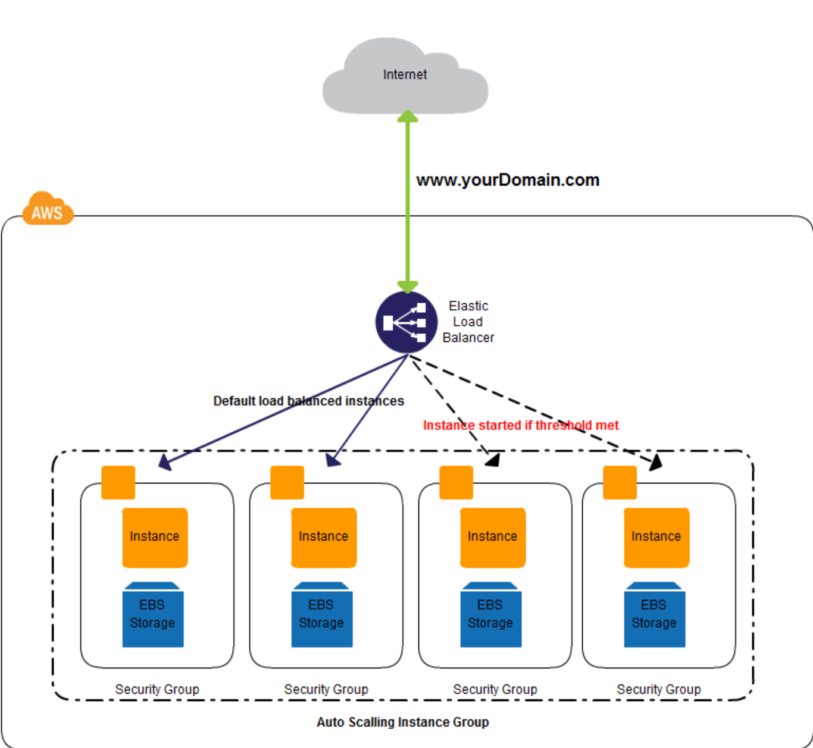

# Introduction

This guide covers the basics for setting up a development environment on a new Mac. Whether you are an experienced programmer or not, this guide is intended for everyone to use as a reference for setting up your environment or installing languages/libraries

<table>
  <thead>
    <tr>
      <th style="text-align:center">Secure SSH Client/Server</th>
      <th style="text-align:left">AWS EC2 Instance</th>
    </tr>
  </thead>
  <tbody>
    <tr>
      <td style="text-align:center">
        

        

          
        

      </td>
      <td style="text-align:left">
        
      </td>
    </tr>
  </tbody>
</table>

