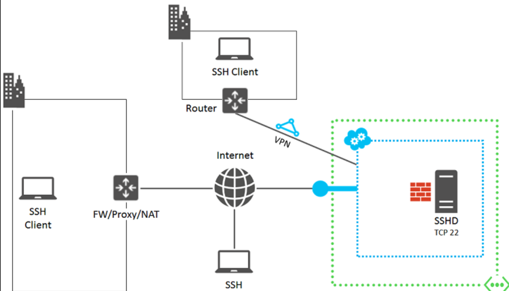

# Introduction

#### 🚀: [jonathanlau.io ](www.jonathanlau.io)▪ 💻[Github](https://www.github.com/laujonat) ▪ 💼: [LinkedIn](https://www.linkedin.com/in/jonathanhlau/)  ▪ 📝 [Medium](https://medium.com/@jonhlau28) 

## Welcome

## Purpose

This guide covers the basics for setting up a development environment on a new Mac. Whether you are an experienced programmer or not, this guide is intended for everyone to use as a reference for setting up your environment or installing languages/libraries

 lightweight guide and introduce key concepts involved configuring AWS EC2 instances. 

## Technologies

