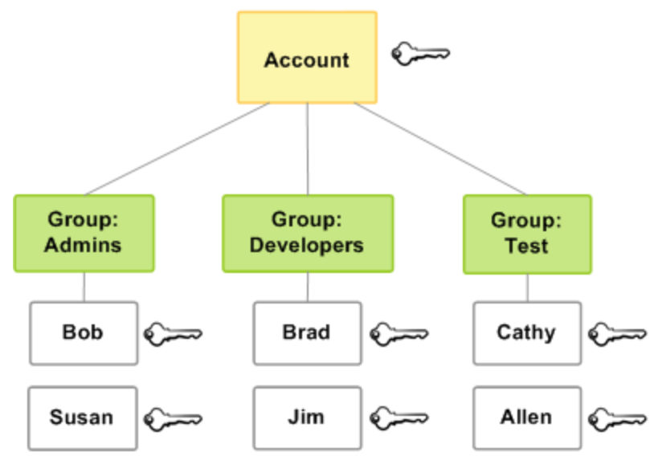

# IAM - Identity Access Management

## **Identities**

`Source:` [**`https://docs.aws.amazon.com/IAM/latest/UserGuide/id.html`**](https://docs.aws.amazon.com/IAM/latest/UserGuide/id.html)**\`\`**

* \*\*\*\*[**The AWS Account Root User**](https://docs.aws.amazon.com/IAM/latest/UserGuide/id_root-user.html)\*\*\*\*
  * `The root account user has access to root user credentials`
* \*\*\*\*[**IAM Users**](https://docs.aws.amazon.com/IAM/latest/UserGuide/id_users.html)\*\*\*\*
  * `An IAM user is an entity that you create in AWS. The IAM user represents the person or service who uses the IAM user to interact with AWS`
* \*\*\*\*[**IAM Groups**](https://docs.aws.amazon.com/IAM/latest/UserGuide/id_groups.html)\*\*\*\*
  * `You can use groups to specify permissions for a collection of users, which can make those permissions easier to manage for those users.`
  * `For example, users in the Developers group may have restricted access permissions to this group.` 
* \*\*\*\*[**IAM Roles**](https://docs.aws.amazon.com/IAM/latest/UserGuide/id_roles.html)\*\*\*\*
  * `An IAM role is very similar to a User in that it is an identity with permission policies that determine what the identity can and cannot do in AWS.` 
  * `Roles do not have any credentials (password or access keys) associated with it.`
  * `Instead of being uniquely associated with one person, a role is intended to be assumable by anyone who needs it`

## Terminology

* **Host** 
  * `Defines for which host or hosts the configuration section applies. The section ends with a new Host section or the end of the file.` 
  * `A single * as a pattern can be used to provide global defaults for all hosts.`
* **HostName** 
  * `Specifies the real host name to log into. Numeric IP addresses are also permitted.`
* **User** 
  * `Defines the username for the SSH connection.`
* **IdentityFile** 
  * `Specifies a file from which the user’s authentication identity is read.` 
  * **`Common Encryption Algorithms`**
    * _**`RSA`**_ 
    * _**`ECDSA`**_
    * _**`DSA`**_
  * `These are encryption protocols, each containing their own unique approach to encryption.` 

Reference: [https://security.stackexchange.com/questions/178958/what-are-the-differences-between-the-rsa-dsa-and-ecdsa-keys-that-ssh-uses?noredirect=1&lq=1](https://security.stackexchange.com/questions/178958/what-are-the-differences-between-the-rsa-dsa-and-ecdsa-keys-that-ssh-uses?noredirect=1&lq=1)

#### Protocols

`Network protocols are sets of established rules that dictate how to format, transmit and receive data so computer network devices -- from servers and routers to endpoints -- can communicate regardless of the differences in their underlying infrastructures, designs or standards.`

Source: [https://searchnetworking.techtarget.com/definition/protocol](https://searchnetworking.techtarget.com/definition/protocol)

**Port** 

* `Specifies the port number to connect on the remote host.`
* **Protocol** `Specifies the protocol versions ssh(1) should support in order of preference.` 
  * `The possible values are` **`1`** `and` **`2`**`.`
* **Protocol Version 1**
  * `The default is ~/.ssh/identity for protocol version 1`
* **Protocol Version 2**
  * `~/.ssh/id_dsa`, `~/.ssh/id_ecdsa` and `~/.ssh/id_rsa` 
* **ProxyCommand**  
  * `Specifies the command to use to connect to the server. The command string extends to the end of the line, and is executed with the user’s shell.`
  * **Command string substitutions**
    * `%h` - `Host name to connect`
    * `%p`  - `Substitute by Port` 
    * `%r` - `Remote user name` 
  * _e.g:`[ec2-user]$ ProxyCommand`_
    * `~/usr/bin/nc -X connect -x 192.1.0.253:3128 %h %p`
* **LocalForward** 
  * `Specifies that a TCP port on the local machine be forwarded over the secure channel to the specified host and port from the remote machine.` 
  * `The first argument must be [bind_address:]port and the second argument must be host:hostport.`
* \*\*\*\*
* **ServerAliveInterval**
  * `Sets a timeout interval in seconds after which if no data has been received from the server`
  * **`ssh(1)`**
    * `will send a message through the encrypted channel to request a response from the server.` 
*  **ServerAliveCountMax**
  * `Sets the number of server alive messages which may be sent without` **`ssh(1)`** `receiving any messages back from the server.` 
  * `Ssh will disconnect from the server, terminating the session after threshold is met.`

