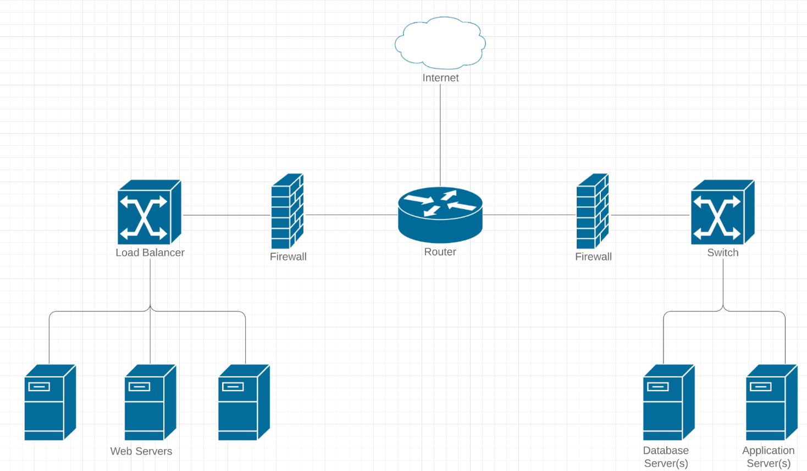

# Networking

## Introduction

Before you can configure your remote server instance, it is important to understand common terms that you will encounter regularly. 

Recommended Reads :  [Website Terminology](https://www.pagecloud.com/blog/website-terminology), [Stateless vs Stateful Protocols](https://www.geeksforgeeks.org/difference-between-stateless-and-stateful-protocol/)

_Networking_ refers to what information is intended or not intended to be transferred through a network. This process of transferring information is called a **Connection.**

The chunks of information transferred over a network  known as **Packets.** 

\*\*\*\*

## Internet 

* **IPV4**
  * `Fourth revision of the Internet Protocol (IP) used to to identify devices on a network through an addressing system.`
* **IPV6**
  * `IPv6 is the successor to Internet Protocol Version 4 (IPv4).` 
  * `It was designed as an evolutionary upgrade to the Internet Protocol and will.`
  * `IPv6 is designed to allow the Internet to grow steadily, both in terms of the number of hosts connected and the total amount of data traffic transmitted.`
* **Transmission Control Protocol \(**[**TCP**](https://searchnetworking.techtarget.com/definition/TCP)**\)**
  * `Uses a set of rules to exchange messages with other internet points at the information packet level.`
* **User Datagram Protocol \(**[**UDP**](https://searchnetworking.techtarget.com/definition/UDP-User-Datagram-Protocol)**\)**
  * `Acts as an alternative communication protocol to TCP and is used to establish low-latency and loss-tolerating connections between applications and the Internet.`
* **Internet Protocol \(**[**IP**](https://searchunifiedcommunications.techtarget.com/definition/Internet-Protocol)**\)**
  * `Set of rules to send and receive messages at the Internet address level.`
  * `Uniquely identifies a host from all other computers on the internet`
* **Hypertext Transfer Prot`ocol (`**[**`HTTP`**](https://searchwindevelopment.techtarget.com/definition/HTTP)**`)`** 
  * _**`Stateless`**_`Protocol` 
  * `Each command is executed independently, without any knowledge of the commands that came before it.`
* **Hypertext Transfer Protocol \(**[**HTTPS**](https://www.cloudflare.com/learning/ssl/what-is-https/)**\)** 
  * `HTTPS uses an encryption protocol to encrypt communications.` 
  * `The protocol is called Transport Layer Security(TLS), although formerly it was known as Secure Sockets Layer (SSL)`
* **Transport Layer Security \(**[**TLS**](https://www.networkworld.com/article/2303073/lan-wan-what-is-transport-layer-security-protocol.html)**\)**
  * `TLS handshake protocol enables the client and server to authenticate each other and to negotiate security keys before any data is transmitted.`
* **File Transfer Protocol \(**[**FTP**](https://searchenterprisewan.techtarget.com/definition/File-Transfer-Protocol)**\)**
  * _`Stateful`_`Protocol`
    * `The client establishes a Control`_`Connection`_`for the duration of an FTP session that typically spans multiple data transfers.`
  * `Standard for transfer of files and records over a` _`TCP/IP`_ `network`

#### Sources

* [https://en.wikipedia.org/wiki/Internet\_Protocol](https://en.wikipedia.org/wiki/Internet_Protocol)
* [https://searchunifiedcommunications.techtarget.com/definition/Internet-Protocol](https://searchunifiedcommunications.techtarget.com/definition/Internet-Protocol)
* [https://www.webopedia.com/TERM/H/HTTP.html](https://www.webopedia.com/TERM/H/HTTP.html)
* [https://www.webopedia.com/DidYouKnow/Internet/ipv6\_ipv4\_difference.html](https://www.webopedia.com/DidYouKnow/Internet/ipv6_ipv4_difference.html)

