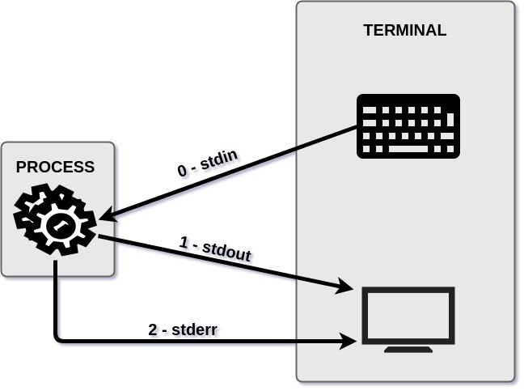

# Overview

## Introduction

Shell provides a layer between you and the intricacies of an operating system.  You can build complex operations by combining basic functions. Using programming constructs, you can then build functions for direct execution in the shell or save functions as _shell scripts_. 

Scripts run in the shell and read by the shell's interpreter. It is useful for creating custom commands and automating day to day tasks.  Ultimately, shell scripting maximizes developer efficiency and productivity. 

**Here are some things you can do with Shell environments:**  

* Modify global and user profiles
* Set environment variables when you log in or spawn a new shell
* Create bash functions for frequently used sequences of commands
* Maintain skeleton directories for new user accounts
* Set your command search path

**Useful Reads**

* [https://developer.ibm.com/tutorials/l-lpic1-105-1/](https://developer.ibm.com/tutorials/l-lpic1-105-1/)
* [https://docs.oracle.com/cd/E19120-01/open.solaris/819-2379/userconcept-26/index.html](https://docs.oracle.com/cd/E19120-01/open.solaris/819-2379/userconcept-26/index.html)
* [https://searchdatacenter.techtarget.com/definition/Linux-stream](https://searchdatacenter.techtarget.com/definition/Linux-stream)

## I/O Redirection

Linux provides a mechanism that allows users to manage inputs _**to**_ and outputs _**from**_ programs.  This process is known as **Streams.**

### **Streams**

Linux shells use three standard streams:

* **Standard Input** – Generally, input is done by a keyboard. Commands are then executed when they are typed onto the display.
* **Standard Output** – Displays the output from commands, usually to the terminal.
* **Standard Error** – Displays error output from commands. It is usually sent to the same output as standard output, but it can be redirected.

The streams are also numbered:

* **stdin** \(**0**\)
* **stdout** \(**1**\)
* **stderr** \(**2**\)

Different Linux [commands](https://searchwindowsserver.techtarget.com/definition/command), such as `sed`, allow users to manipulate the stream text, in this case editing the stream.

#### Sources 

* [Digital Ocean Linux I/O](https://www.digitalocean.com/community/tutorials/an-introduction-to-linux-i-o-redirection)
* [Advanced Reading](https://www.putorius.net/linux-io-file-descriptors-and-redirection.html)

## Executables

Unix-like operating systems provides the `/bin`directory which contains programs you may call directly from the command line.  These are called _executables_ because they are ready to be run when the system starts. 

* `/bin`
  * Standard subdirectory of the root directory in Unix-like operating systems that contains the executable \(i.e., ready to run\) programs that must be available in order to attain minimal functionality for the purposes of booting \(i.e., starting\) and repairing a system 
* `/usr/bin`
  * Standard directory on [Unix-like](http://www.linfo.org/unix-like.html) [operating systems](http://www.linfo.org/operating_systems_list.html) that contains most of the [_executable files_](http://www.linfo.org/executable.html) \(i.e., ready-to-run [programs](http://www.linfo.org/program.html)\) that are not needed for booting \(i.e., starting\) or repairing the system

#### Source

* [http://www.linfo.org/](http://www.linfo.org/)

## Scripts

### Login Shell

### Interactive Shells 

### Non-interactive Shells

#### Source

* [https://www.vanimpe.eu/2014/01/18/different-shell-types-interactive-non-interactive-login/](https://www.vanimpe.eu/2014/01/18/different-shell-types-interactive-non-interactive-login/)

